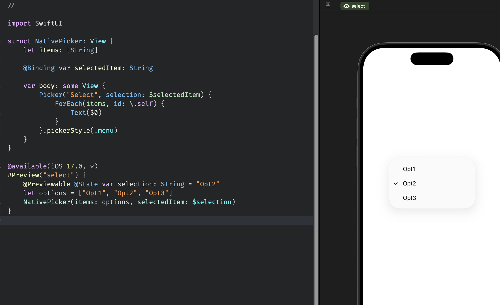
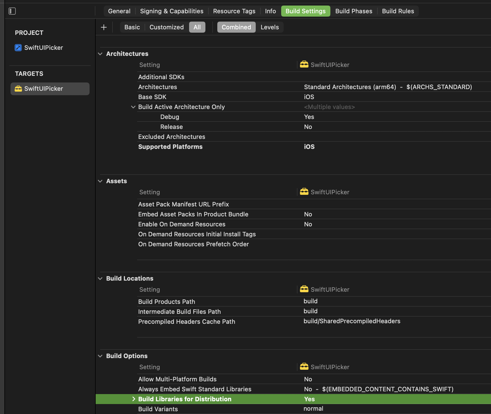

# .NET MAUI July 2026

Hello to fellow .NET developers. I really like native SwiftUI pickers and the flexitiy it provides creating a great UX.
In this article we will explore how to bring native Swift UI picker into .NET MAUI.

## Content Index

- [.NET MAUI July 2026](#net-maui-july-2026)
  - [Content Index](#content-index)
    - [1. SwiftUI Picker library](#1-swiftui-picker-library)
    - [2. MAUI Binding Library](#2-maui-binding-library)
    - [3. Using MAUI bound SwiftUI Picker](#3-using-maui-bound-swiftui-picker)

### 1. SwiftUI Picker library

In order to use the SwiftUI native picker we first need to pack it into a framework library so that [Objective Sharpie](https://learn.microsoft.com/en-us/dotnet/maui/ios/objective-sharpie/get-started?view=net-maui-10.0) or [swift-dotnet-bindings](https://github.com/justinwojo/swift-dotnet-bindings) can use it to parse into [Native Library Interop](https://learn.microsoft.com/en-us/dotnet/communitytoolkit/maui/native-library-interop/) which .NET understands.

1. Open Xcode
2. Create new project > Choose Framework under Frameworks & Library section.

3. Give it a name and choose a location to save.
4. Create
5. Under Project Targets > General, keep only iOS and iPad and delete the rest, unless you want to support those platforms as well.
6. Lower the minimum deployments to iOS 15 or something, I am choosing 15 because that is the least Xcode allows me to.

7. Add SwiftUI file and code for Picker.
I am calling it `NativePicker` and adding simple implementation.

    ```swift
    import SwiftUI
    
    struct NativePicker: View {
        let items: [String]
    
        @Binding var selectedItem: String
    
        var body: some View {
            Picker("Select", selection: $selectedItem) {
                ForEach(items, id: \.self) {
                    Text($0)
                }
            }.pickerStyle(.menu)
        }
    }
    ```

8. Also quickly verified that it works by adding preview

    ```swift
    @available(iOS 17.0, *)
    #Preview("select") {
        @Previewable @State var selection: String = "Opt2"
        let options = ["Opt1", "Opt2", "Opt3"]
        NativePicker(items: options, selectedItem: $selection)
    }
    ```

    

9. Add Objective C PickerBridge so that Swift is interoped to UIKit which MAUI is more familiar with. Note that this acts as intermediator between binding value when it changed from UI to C# and vice versa. I decided against Sharpie. More on that later.

    ```swift
    @objc public class PickerBridge: NSObject, ObservableObject {
        @Published var selectedItem: String
        private var items: [String]
        private var hostingController: UIHostingController<NativePicker>?
    
        @objc public var uiView: UIView? {
            hostingController?.view
        }
    
        @objc public init(items: [String], selected: String) {
            self.items = items
            selectedItem = selected
            super.init()
    
            let binding = Binding<String>(
                get: { self.selectedItem },
                set: { self.selectedItem = $0 }
            )
            let view = NativePicker(items: items, selectedItem: binding)
            hostingController = UIHostingController(rootView: view)
        }
    
        @objc public func setSelected(_ item: String) {
            selectedItem = item
        }
    }
    ```

10. Now set `Build Libraries for distribution` to `Yes`


11. Set `Skip install` to `No` under Build Settings > Deployment


12. Now build the project for both simulator and iPhone targets so that it can run on them when we develop.

    ```powershell
    xcodebuild archive -scheme SwiftUIPicker -destination "generic/platform=iOS Simulator" -archivePath build/sim.xcarchive SKIP_INSTALL=NO BUILD_LIBRARY_FOR_DISTRIBUTION=YES
    
    xcodebuild archive -scheme SwiftUIPicker -destination "generic/platform=iOS" -archivePath build/ios.xcarchive SKIP_INSTALL=NO BUILD_LIBRARY_FOR_DISTRIBUTION=YES
    ```

13. Once these are completed, you will see two xcframework files in `build` folder.  
ios.xcarchive  
sim.xcarchive  

Now run the following command to combine them into single framework

```powershell
xcodebuild -create-xcframework `
  -framework build/ios.xcarchive/Products/Library/Frameworks/SwiftUIPicker.framework `
  -framework build/sim.xcarchive/Products/Library/Frameworks/SwiftUIPicker.framework `
  -output build/SwiftUIPicker.xcframework
```

This will create our final framework library.

### 2. MAUI Binding Library

Initially tried Objective Sharpie but soon started getting header not present in framework error. I could not figure out project setting which makes it generate for newer Xcodes. So solution was to find header files in `~/Library/Developer/Xcode/DerivedData` and manually copy and rebuild framework file.
Instead I wanted to try out [swift-dotnet-bindings](https://wojosoftware.com/blog/swift-dotnet-binding-tool/) and it made the process a breeze.

Here are the just 5 simple steps as opposed to manually updating ApiDefinitions Enums after Sharpie Bind and scratch head with trial and errors.

1. Install the Template

    `dotnet new install SwiftBindings.Templates`

2. Create a Binding Project

    `dotnet new swift-binding -n SwiftUIPickerMauiBindings`

3. Drop in the `SwiftUIPicker.xcframework` generated earlier inside `SwiftUIPickerMauiBindings` folder.

4. Build

   `dotnet build ./SwiftUIPickerMauiBindings.csproj`

   This will generate SwiftUIPickerMauiBindings.dll in `bin` folder.  

5. Pack

   `dotnet pack ./SwiftUIPickerMauiBindings.csproj`

   This will generate nuget package in `bin/Release` folder which we can install in our MAUI project to use. I did not even need to enter details for nuget info.

### 3. Using MAUI bound SwiftUI Picker

Now we have are at the final stage.

1. Create .NET MAUI project.

    `dotnet new maui -f net10.0 -n MauiSwiftUiPicker`

2. Remove Windows and Mac-Catalyst targets unless you want to support them.
3. Install MAUI binding nuget to the project.

    `dotnet add package SwiftUIPickerMauiBindings --source ../SwiftUIPickerMauiBindings/bin/Release`

4. Now verify that the project builds fine.
5. Add picker custom control.

    ```csharp
    public class NativePicker : View
    {
        public static readonly BindableProperty ItemsSourceProperty = BindableProperty.Create(propertyName: nameof(ItemsSource),
                                                                                              returnType: typeof(IList<string>),
                                                                                              declaringType: typeof(NativePicker),
                                                                                              defaultValue: new List<string>());
        public IList<string> ItemsSource
        {
            get => (IList<string>)GetValue(ItemsSourceProperty);
            set => SetValue(ItemsSourceProperty, value);
        }
    
        public static readonly BindableProperty SelectedItemProperty = BindableProperty.Create(propertyName: nameof(SelectedItem),
                                                                                               returnType: typeof(string),
                                                                                               declaringType: typeof(NativePicker),
                                                                                               defaultValue: default(string),
                                                                                               defaultBindingMode: BindingMode.TwoWay);
    
        public string SelectedItem
        {
            get => (string)GetValue(SelectedItemProperty);
            set => SetValue(SelectedItemProperty, value);
        }
    }
    ```

6. Add handler to invoke bound MAUI native control.

    ```csharp
    public partial class NativePickerHandler : ViewHandler<NativePicker, UIView>
    {
        public static PropertyMapper<NativePicker, NativePickerHandler> Mapper =
            new(ViewHandler.ViewMapper)
            {
                [nameof(NativePicker.SelectedItem)] = MapSelectedItem,
            };
    
        PickerBridge? _bridge;
    
        public NativePickerHandler() : base(Mapper) { }
    
        protected override UIView CreatePlatformView()
        {
            _bridge = new PickerBridge(VirtualView.ItemsSource ?? new List<string>(), VirtualView.SelectedItem ?? string.Empty);
            return _bridge?.UiView ?? new UIView();
        }
    
        public static void MapSelectedItem(NativePickerHandler handler, NativePicker view)
        {
            handler._bridge?.SetSelected(view.SelectedItem);
        }
    }
    ```

7. Register handler in `MauiProgram`

    ```csharp
    #if IOS
        builder.ConfigureMauiHandlers(handlers =>
        {
            handlers.AddHandler<NativePicker, NativePickerHandler>();
        });
    #endif
    ```

8. Add `NativePicker` in Xaml or C# and verify that it works.

    ```xaml
    <VerticalStackLayout Spacing="8"
                         Padding="16,32">
        <ui:NativePicker ItemsSource="{Binding PickerItems}"
                         SelectedItem="{Binding SelectedGenre}" />
        <Label Margin="{Thickness Top=8}"
               Text="{Binding SelectedGenre, StringFormat='Selected genre: {0}'}" />
    </VerticalStackLayout>
    ```
