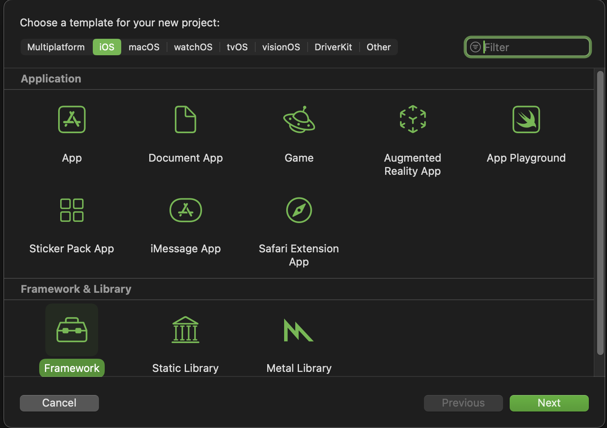
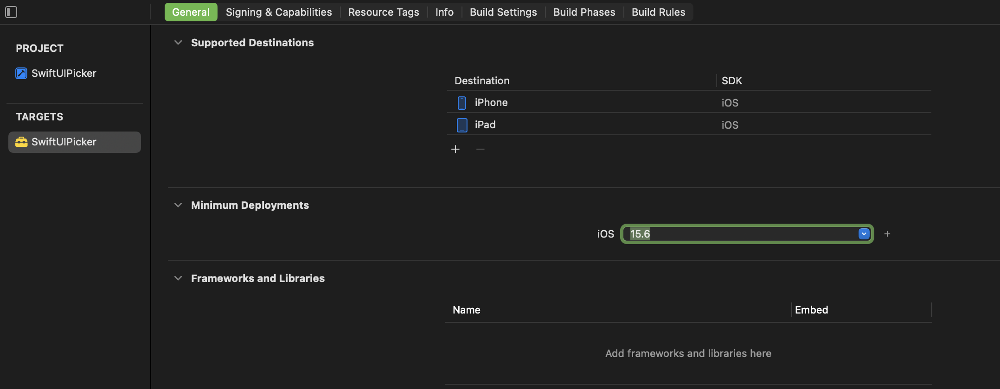
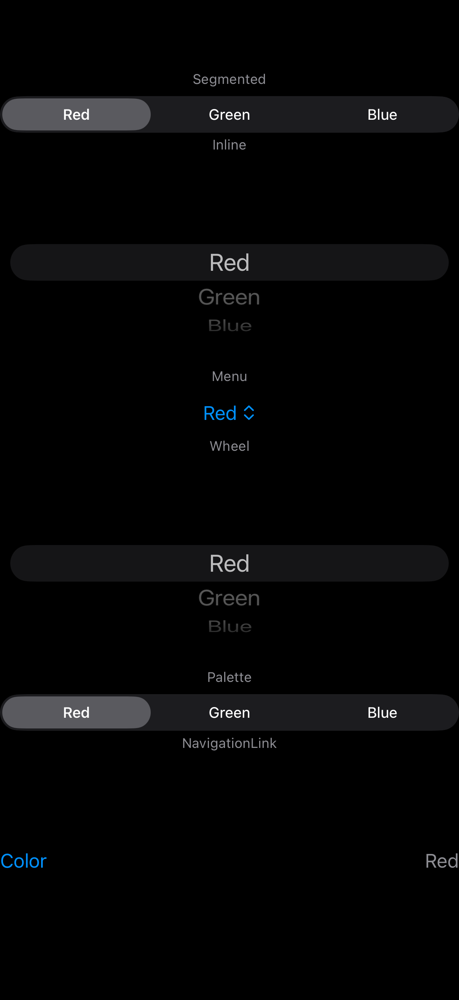
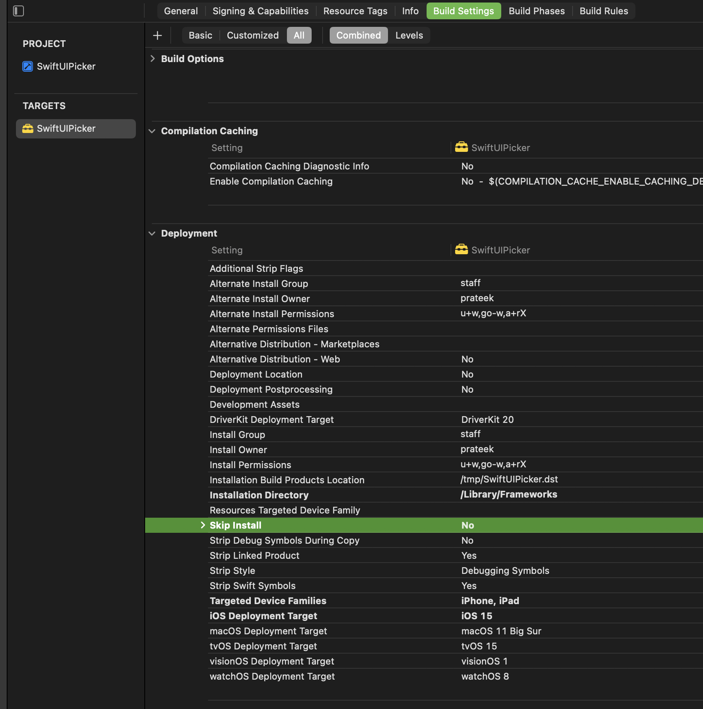

<!-- markdownlint-disable-next-line single-h1  -->
# .NET MAUI July 2026

Hello to fellow .NET developers. I really like native SwiftUI pickers and the flexibility it provides creating a great UX.
In this article we will explore how to bring native Swift UI picker into .NET MAUI.

## Content Index

- [.NET MAUI July 2026](#net-maui-july-2026)
  - [Content Index](#content-index)
    - [I. SwiftUI Picker library](#i-swiftui-picker-library)
    - [II. MAUI Binding Library](#ii-maui-binding-library)
    - [III. Using MAUI bound SwiftUI Picker](#iii-using-maui-bound-swiftui-picker)
  - [Final Screen Capture](#final-screen-capture)

### I. SwiftUI Picker library

In order to use the SwiftUI native picker we first need to pack it into a framework library so that [Objective Sharpie](https://learn.microsoft.com/en-us/dotnet/maui/ios/objective-sharpie/get-started?view=net-maui-10.0) or [swift-dotnet-bindings](https://github.com/justinwojo/swift-dotnet-bindings) can use it to parse into [Native Library Interop](https://learn.microsoft.com/en-us/dotnet/communitytoolkit/maui/native-library-interop/) which .NET understands.

1. Open Xcode
2. Create new project > Choose Framework under Frameworks & Library section.
    
3. Give it a name and choose a location to save.
4. Create
5. Under Project Targets > General, keep only iOS and iPad and delete the rest, unless you want to support those platforms as well.
6. Lower the minimum deployments to iOS 15 or something, I am choosing 15 because that is the least Xcode allows me to.
    
7. Add SwiftUI file and code for Picker. I am calling it `NativePicker` and adding simple implementation.

    ```swift
    public struct NativePicker: View {
        // MARK: - Properties
    
        let items: [String]
        let title: String
        let style: NativePickerStyle
        @Binding var selectedItem: String
    
        // MARK: - Init
    
        public init(title: String,
                    items: [String],
                    selectedItem: Binding<String>,
                    style: NativePickerStyle) {
            self.items = items
            self.title = title
            self.style = style
            _selectedItem = selectedItem
        }
    
        // MARK: - Template
    
        var pickerContent: some View {
            Picker(title, selection: $selectedItem) {
                ForEach(items, id: \.self) { Text($0) }
            }
        }
    
        public var body: some View {
            switch style {
            case .segmented: pickerContent.pickerStyle(.segmented)
            case .inline: pickerContent.pickerStyle(.inline)
            case .menu: pickerContent.pickerStyle(.menu)
            case .wheel: pickerContent.pickerStyle(.wheel)
            case .palette:
                if #available(iOS 17.0, *) {
                    pickerContent.pickerStyle(.palette)
                } else {
                    pickerContent.pickerStyle(.automatic)
                }
            case .navigationLink:
                if #available(iOS 16.0, *) {
                    NavigationStack {
                        pickerContent.pickerStyle(.navigationLink)
                    }
                } else {
                    pickerContent.pickerStyle(.automatic)
                }
            case .automatic:
                pickerContent.pickerStyle(.automatic)
            }
        }
    }
    ```

    Note the `public` access modifier so the view is visible outside its module. This is needed by the binding generator (and the bridge) to construct `NativePicker` from outside `SwiftUIPicker`. Without it, `NativePicker`, including `selectedItem` would default to `internal` and be invisible to the generated C# bindable property. Making a struct `public` does not automatically make its memberwise initializer `public`, we would need to write an explicit `public init`.

    Also note that `PickerStyle.navigationLink` is available for iOS 16 and higher, similarly `PickerStyle.palette` is available for iOS 17 and higher. So fallbacks are set to be `PickerStyle.automatic`.

8. Also quickly verify that it works by adding previews.

    ```swift
    #Preview {
        Group {
            Text("Segmented")
                .font(.caption)
                .foregroundStyle(.secondary)
            NativePicker(title: "Color",
                            items: ["Red", "Green", "Blue"],
                            selectedItem: .constant("Red"),
                            style: .segmented)
        }
        Group {
            Text("Inline")
                .font(.caption)
                .foregroundStyle(.secondary)
            NativePicker(title: "Color",
                            items: ["Red", "Green", "Blue"],
                            selectedItem: .constant("Red"),
                            style: .inline)
        }
        Group {
            Text("Menu")
                .font(.caption)
                .foregroundStyle(.secondary)
            NativePicker(title: "Color",
                            items: ["Red", "Green", "Blue"],
                            selectedItem: .constant("Red"),
                            style: .menu)
        }
        Group {
            Text("Wheel")
                .font(.caption)
                .foregroundStyle(.secondary)
            NativePicker(title: "Color",
                            items: ["Red", "Green", "Blue"],
                            selectedItem: .constant("Red"),
                            style: .wheel)
        }
        Group {
            Text("Palette")
                .font(.caption)
                .foregroundStyle(.secondary)
            NativePicker(title: "Color",
                            items: ["Red", "Green", "Blue"],
                            selectedItem: .constant("Red"),
                            style: .palette)
        }
        Group {
            Text("NavigationLink")
                .font(.caption)
                .foregroundStyle(.secondary)
            NativePicker(title: "Color",
                            items: ["Red", "Green", "Blue"],
                            selectedItem: .constant("Red"),
                            style: .navigationLink)
        }
    }
    ```

    

9. We need to add `PickerBridge` so that Swift is interoped to UIKit which MAUI is more familiar with. Note that this acts as intermediator between binding value when it changed from UI to C# and vice versa. I decided against Sharpie. More on that later.

    ```swift
    public class PickerBridge: NSObject, ObservableObject {
        // MARK: - Properties
    
        @Published var selectedItem: String {
            didSet { onSelectionChanged?(selectedItem); refreshView() }
        }
    
        @Published var items: [String] {
            didSet { refreshView() }
        }
    
        @Published var title: String {
            didSet { refreshView() }
        }
    
        @Published var style: NativePickerStyle {
            didSet { refreshView() }
        }
    
        private var hostingController: UIHostingController<NativePicker>?
        private var onSelectionChanged: ((String) -> Void)?
    
        public var uiView: UIView? {
            hostingController?.view
        }
    
        // MARK: - Init
    
        public init(title: String,
                    items: [String],
                    selected: String,
                    style: NativePickerStyle,
                    onSelectionChanged: @escaping (String) -> Void) {
            self.items = items
            selectedItem = selected
            self.title = title
            self.style = style
            self.onSelectionChanged = onSelectionChanged
            super.init()
            hostingController = UIHostingController(rootView: makeView())
        }
    
        private func makeView() -> NativePicker {
            let binding = Binding<String>(get: { self.selectedItem },
                                          set: { self.selectedItem = $0 })
    
            return NativePicker(title: title,
                                items: items,
                                selectedItem: binding,
                                style: style)
        }
    
        private func refreshView() {
            hostingController?.rootView = makeView()
        }
    
        // MARK: - Handlers
    
        public func setSelected(_ item: String) {
            selectedItem = item
        }
    
        public func updateItems(_ newItems: [String]) {
            items = newItems
        }
    
        public func updateTitle(_ newTitle: String) {
            title = newTitle
        }
    
        public func updateStyle(_ newStyle: NativePickerStyle) {
            style = newStyle
        }
    }
    ```

10. Now set **Build Libraries for distribution** to *Yes*
    

11. Set **Skip install** to *No* under Build Settings > Deployment
    

12. Now build the project for both simulator and iPhone targets so that it can run on them when we develop.

    ```powershell
    # Simulator
    xcodebuild archive -scheme SwiftUIPicker -destination "generic/platform=iOS Simulator" -archivePath build/sim.xcarchive SKIP_INSTALL=NO BUILD_LIBRARY_FOR_DISTRIBUTION=YES
    
    # iPhone
    xcodebuild archive -scheme SwiftUIPicker -destination "generic/platform=iOS" -archivePath build/ios.xcarchive SKIP_INSTALL=NO BUILD_LIBRARY_FOR_DISTRIBUTION=YES
    ```

13. Once these are completed, you will see two xcframework files in `build` folder.  
ios.xcarchive  
sim.xcarchive  

Now run the following command to combine them into single framework

```powershell
xcodebuild -create-xcframework `
  -framework build/ios.xcarchive/Products/Library/Frameworks/SwiftUIPicker.framework `
  -framework build/sim.xcarchive/Products/Library/Frameworks/SwiftUIPicker.framework `
  -output build/SwiftUIPicker.xcframework
```

This will create our final framework library.

### II. MAUI Binding Library

Initially tried Objective Sharpie but soon started getting header not present in framework error. I could not figure out project setting which makes it generate for newer Xcode. So solution was to find header files in `~/Library/Developer/Xcode/DerivedData` and manually copy and rebuild framework file.
Instead I wanted to try out [swift-dotnet-bindings](https://wojosoftware.com/blog/swift-dotnet-binding-tool/) and it made the process easier.

Here are just 5 simple steps as opposed to manually updating ApiDefinitions & Enums after Sharpie Bind and scratching my head with trial and error and this is why I ended up not using Sharpie.

1. Install the template.

    `dotnet new install SwiftBindings.Templates`

2. Create a C# iOS binding project.

    `dotnet new swift-binding -n SwiftUIPickerMauiBindings`

3. Drop in the `SwiftUIPicker.xcframework` generated earlier inside **SwiftUIPickerMauiBindings** folder.

4. Build

   `dotnet build ./SwiftUIPickerMauiBindings.csproj`

   This will generate SwiftUIPickerMauiBindings.dll in `bin` folder. We can use [ilspy-vscode](https://marketplace.visualstudio.com/items?itemName=icsharpcode.ilspy-vscode) VS Code extension to decompile and inspect binding classes generated.

5. Pack

   `dotnet pack ./SwiftUIPickerMauiBindings.csproj`

   This will generate nuget package in `bin/Release` folder which we can install in our MAUI project to use. I did not even need to enter details for nuget info. If we make changes and regenerate it is better to increment version with `--version <version>` argument so that dotnet does not use cached nuget.

> Note: The library claims that it auto generates bridge files but when I removed PickerBridge it did not generate C# class, there was `*.bridge` file in **obj** folder which required further manual edits to make to work. Moreover SwiftUI's Picker selection binding is built on a `WritableKeyPath` internally: a Swift mechanism for referencing a mutable property path which the binding generator's auto-bridge feature doesn't support, so I kept the hand-written `PickerBridge` instead.

### III. Using MAUI bound SwiftUI Picker

Now we are at the final stage.

1. Create .NET MAUI project.

    `dotnet new maui -f net10.0 -n MauiSwiftUiPicker`

2. Remove Windows and Mac-Catalyst targets unless you want to support them.

    ```xml
    <PropertyGroup>
        <TargetFrameworks>net10.0-android</TargetFrameworks>
        <TargetFrameworks Condition="!$([MSBuild]::IsOSPlatform('linux'))">$(TargetFrameworks);net10.0-ios</TargetFrameworks>
        <!-- 
            Other 
            csproj
            settings
        -->
        <SupportedOSPlatformVersion Condition="$([MSBuild]::GetTargetPlatformIdentifier('$(TargetFramework)')) == 'ios'">15.6</SupportedOSPlatformVersion>
        <SupportedOSPlatformVersion Condition="$([MSBuild]::GetTargetPlatformIdentifier('$(TargetFramework)')) == 'android'">21.0</SupportedOSPlatformVersion>
    </PropertyGroup>
    ```

3. Install MAUI binding nuget to the project.

    `dotnet add package SwiftUIPickerMauiBindings --source ../SwiftUIPickerMauiBindings/bin/Release`

4. Now verify that the project builds fine.
5. Add picker custom control.

    ```csharp
    public class NativePicker : View
    {
        public static readonly BindableProperty TitleProperty = BindableProperty.Create(propertyName: nameof(Title),
                                                                                        returnType: typeof(string),
                                                                                        declaringType: typeof(NativePicker),
                                                                                        defaultValue: string.Empty);
    
        public string Title
        {
            get => (string)GetValue(TitleProperty);
            set => SetValue(TitleProperty, value);
        }
    
    
        public static readonly BindableProperty ItemsSourceProperty = BindableProperty.Create(propertyName: nameof(ItemsSource),
                                                                                              returnType: typeof(IList<string>),
                                                                                              declaringType: typeof(NativePicker),
                                                                                              defaultValue: new List<string>());
    
        public IList<string> ItemsSource
        {
            get => (IList<string>)GetValue(ItemsSourceProperty);
            set => SetValue(ItemsSourceProperty, value);
        }
    
        public static readonly BindableProperty SelectedItemProperty = BindableProperty.Create(propertyName: nameof(SelectedItem),
                                                                                               returnType: typeof(string),
                                                                                               declaringType: typeof(NativePicker),
                                                                                               defaultValue: string.Empty,
                                                                                               defaultBindingMode: BindingMode.TwoWay);
    
        public string SelectedItem
        {
            get => (string)GetValue(SelectedItemProperty);
            set => SetValue(SelectedItemProperty, value);
        }
    
        public static readonly BindableProperty KindProperty = BindableProperty.Create(propertyName: nameof(Kind),
                                                                                        returnType: typeof(NativePickerStyle),
                                                                                        declaringType: typeof(NativePicker),
                                                                                        defaultValue: NativePickerStyle.Menu);
    
        public NativePickerStyle Kind
        {
            get => (NativePickerStyle)GetValue(KindProperty);
            set => SetValue(KindProperty, value);
        }
    }
    ```

6. Add handler to invoke bound MAUI native control. Add Mapper for binding properties: SelectedItem, Title and PickerKind. These are the ones that need dynamic updates after the view is created.

    ```csharp
    public class NativePickerHandler() : ViewHandler<NativePicker, UIView>(Mapper)
    {
        private PickerBridge? _bridge;
    
        public static PropertyMapper<NativePicker, NativePickerHandler> Mapper = new(ViewMapper)
        {
            [nameof(NativePicker.SelectedItem)] = MapSelectedItem,
            [nameof(NativePicker.Title)] = MapTitle,
            [nameof(NativePicker.Kind)] = MapPickerKind
        };
    
        protected override UIView CreatePlatformView()
        {
            _bridge = new PickerBridge(title: VirtualView.Title,
                                       items: VirtualView.ItemsSource,
                                       selected: VirtualView.SelectedItem,
                                       style: VirtualView.Kind,
                                       onSelectionChanged: s => DispatchQueue.MainQueue.DispatchAsync(() => VirtualView.SelectedItem = s));
            return _bridge?.UiView ?? new UIView();
        }
    
        public static void MapSelectedItem(NativePickerHandler handler, NativePicker view)
        {
            handler._bridge?.SetSelected(view.SelectedItem);
        }
    
        public static void MapTitle(NativePickerHandler handler, NativePicker view)
        {
            handler._bridge?.UpdateTitle(view.Title);
        }
    
        public static void MapPickerKind(NativePickerHandler handler, NativePicker view)
        {
            handler._bridge?.UpdateStyle(view.Kind);
        }
    }
    ```

    > Note: `onSelectionChanged` callback is important to make the binding TwoWay. I had some difficulty initially figuring this out.

7. Register `NativePickerHandler` in `MauiProgram`

    ```csharp
    #if IOS
        builder.ConfigureMauiHandlers(handlers =>
        {
            handlers.AddHandler<NativePicker, NativePickerHandler>();
        });
    #endif
    ```

8. Add `NativePicker` in Xaml or C# and verify that it works.

    ```xaml
    <Grid RowDefinitions="*,75, 125, 50"
          RowSpacing="8"
          Padding="16,32">
        <ui:NativePicker Grid.Row="0"
                         Title="Select Genre"
                         ItemsSource="{Binding Genres}"
                         SelectedItem="{Binding SelectedGenre, Mode=TwoWay}"
                         Kind="{Binding SelectedPickerKind}"
                         BackgroundColor="Transparent" />
        <Label Grid.Row="1"
               Text="{Binding SelectedGenre, StringFormat='Selected genre: {0}'}"
               FontSize="16"
               HorizontalOptions="Center"
               HorizontalTextAlignment="Center" />
        <ui:NativePicker Grid.Row="2"
                         Title="Picker Kind Selection"
                         ItemsSource="{Binding PickerKinds}"
                         SelectedItem="{Binding SelectedPickerKindText}"
                         Kind="Segmented"
                         Margin="0,16,0,0"
                         BackgroundColor="Transparent" />
        <Label Grid.Row="3"
               Text="{Binding SelectedPickerKind, StringFormat='Selected Picker Kind: {0}'}"
               FontSize="12"
               HorizontalOptions="Center"
               HorizontalTextAlignment="Center" />
    </Grid>
    ```

## Final Screen Capture

<!-- markdownlint-disable-next-line no-inline-html  -->
<video controls src="screen-capture.mov" title="Screen Capture" />
